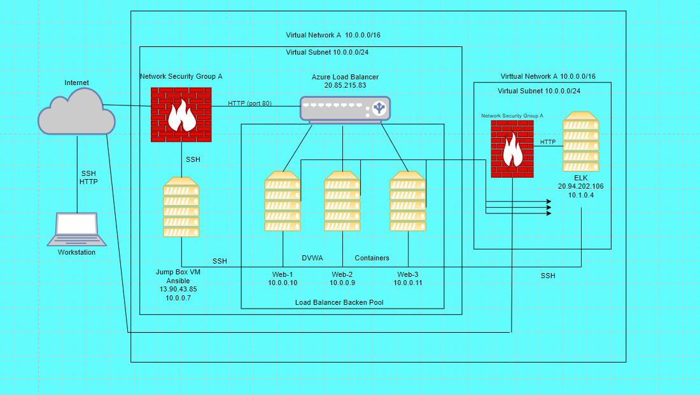
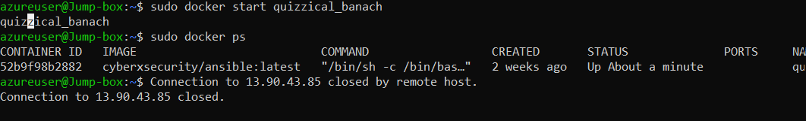

# Automated ELK Stack Deployment

The files in this repository were used to configure the network depicted below.

These files have been tested and used to generate a live ELK deployment on Azure. They can be used to either recreate the entire deployment pictured above.

  [Metricbeat]("C:\Github\scripts\ansible\Metribeat\metricbeat-playbook.yml")
  [Filebeat](./Filebeat/filebeat-playbook.yml)
  [ELK](./ELK/elk.yml)

This document contains the following details:

- Descriptionof the Topology
- Access Policies
- ELK Configuration
- Beats in Use
- Machines Being Monitored
- How to Use the Ansible Build

## Description of the Topology

The main purpose of this network is to expose a load-balanced and monitored instance of DVWA, the D*mn Vulnerable Web Application.

Load balancing ensures that the application will be highly available, in addition to restricting inbound access to the network.

- Theload balancer protects the servers from traffic overload. It also ensures high availability.

Integrating an ELK server allows users to easily monitor the vulnerable VMs for changes to the file systems of the VMs on the network and also watch system metrics.

-The Filebeat ensures that events are delivered to the
 configured output with no data loss.

- Metricbeat records data about every container running
   on the host.

The configuration details of each machine may be found below.

| Name     | Function   | IP Address |Operating System |
|----------|------------|------------|-----------------|
| Jump Box | Gateway    | 10.0.0.7   | Linux           |
| DVWA 1   | Web Server | 10.0.0.10  | Linux           |
| DVWA 2   | Web Server | 10.0.0.9   | Linux           |
| DVWA 3   | Web Server | 10.0.0.11  | Linux           |
| ELK      | Monitoring | 10.1.0.4   | Linux           |

### Access Policies

The machines on the internal network are not exposed to the public Internet.

Only the Jump box_ machine can accept connections from the Internet. Access to this machine is only allowed from the following IP addresses:

- 65.128.53.248

Machines within the network can only be accessed by each other.

- The web Vms allow to access your ELK VM? The IP addresses of the Web Vma are 10.0.0.9, 10.0.0.10, and 10.0.0.11.

A summary of the access policies in place can be found in the table below.

| Name     | Publicly Accessible | Allowed IP Addresses |
|----------|---------------------|----------------------|
| Jump Box | Yes                 | 65.128.53.248------  |
| ELK      | No                  | 10.0.0.1-254         |
| DVWA 1   | No                  | 10.0.0.1-254         |
| DVWA 1   | No                  | 10.0.0.1-254         |
| DVWA 2   | No                  | 10.0.0.1-254         |
| DVWA 3   | No                  | 10.0.0.1-254         |

### Elk Configuration

Ansible was used to automate configuration of the ELK machine. No configuration was performed manually, which is advantageous because it saves time, reduces errors, and uses infrustructure as code.

The playbook implements the following tasks:

- Gathering Facts
- Install docker.io
- Install python3-pip
- Install Docker module
- Increase virtual memory
- Increase virtual memory on restart
- download and launch a docker elk container
- Enable service docker on boot

The following screenshot displays the result of running `docker ps` after successfully configuring the ELK instance.

### Target Machines & Beats

This ELK server is configured to monitor the following machines:

- 10.0.0.9, 10.0.0.10, and 10.0.0.11

We have installed the following Beats on these machines:

- Filebeat
- Metricbeat

These Beats allow us to collect the following information from each machine:

- Filebeat detects changes to the filesystem. Specifically,
   we use it to collect Apache logs.
- Metricbeat detects changes in system metrics, such as CPU usage. We use it to detect SSH login attempts, failed sudo escalations, and CPU/RAM statistics.

### Using the Playbook

In order to use the playbook, you will need to have an Ansible control node already configured. Assuming you have such a control node provisioned:

SSH into the control node and follow the steps below:

- Copy the playbooks file to the ansible control node.
- Update the /etc/ansible/hosts file to include webservers
- Run the playbook, and navigate to ELK to check that the installation worked as expected.

- The playbook files are as follows:
ansible-playbook install_elk.yml elk
ansible-playbook install_filebeat.yml webservers
ansible-playbook install_metricbeat.yml webservers

Where do you copy it?

/etc/ansible

- Which file do you update to make Ansible run the playbook on a specific machine?

[webservers]
10.0.0.9
10.0.0.10
10.0.0.11

How do I specify which machine to install the ELK server on versus which to install Filebeat on?

[elk]
10.0.0.4

- <http://20.94.202.106:5601/app/kibana#/is> the URL to you navigate to in order to check that the ELK server is running?

curl <http://10.0.0.8:5601>

As a **Bonus**, provide the specific commands the user will need to run to download the playbook, update the files, etc.
